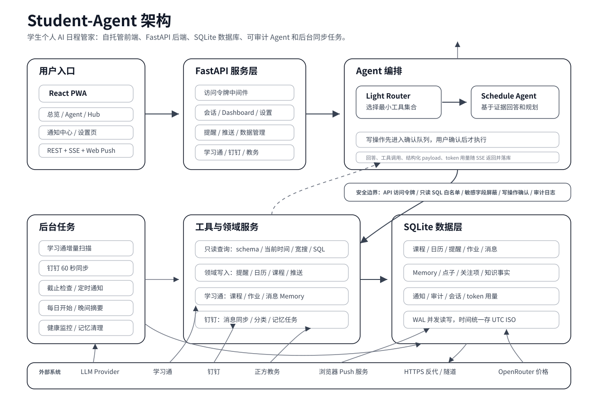

# Student-Agent

Student-Agent 是一个自托管的学生个人 AI 日程管家。它把课程、提醒、日历、学习通、钉钉、通知、点子和长期记忆集中到一套本地数据库里，再通过网页端和 Schedule Agent 帮你查询、规划、确认操作和接收推送。

项目面向真实日常使用：前端是可安装的 React PWA，后端是 FastAPI + SQLite + APScheduler，部署用 Docker Compose + Nginx。所有核心数据留在自己的服务器上，LLM Provider、模型、预算和提示词都可以在设置里调整。



## 核心能力

### 日程总览

- **今日优先级**：首页汇总今天课程、日历事件、提醒、学习通作业、重要消息记忆和待发通知，生成“该先做这些”的行动列表。
- **课程表视图**：按周展示本地课程表和教务导入课程，支持地点、时间、学期信息和当天焦点事项。
- **长期事项**：把未来 7-90 天内的日历、提醒、作业和重要记忆放入长期视野，避免只盯今天。
- **轻量刷新**：Dashboard 先直接读数据库构造 payload，只有内容 hash 变化时才触发 briefing 生成，普通打开页面不会反复消耗 LLM。

### Schedule Agent

- **会话式查询**：可以问“今天有什么课”“最近有哪些 DDL”“计组相关通知有哪些”“帮我查一下钉钉消息”等问题。
- **按需取证**：Agent 先由 Light Router 选择最小工具集合，再通过只读数据库查询、领域读取工具或外部同步服务拉取证据。
- **结构化结果**：课程、提醒、日历、学习通作业、消息记忆和操作结果会随 SSE 一起返回给前端，前端展示为可扫描的卡片。
- **追问承接**：上一轮结构化结果会压缩成 id 映射，用户说“这些”“上面那些”“都删掉”时可以准确解析对象。
- **确认门**：创建、更新、完成、删除、导入、推送等写操作都会进入确认队列，前端确认后才执行。
- **审计记录**：Agent 的写操作会写入 `agent_audit_log`，Hub 里可以查看最近执行过的操作。

### 学习通

- **扫码登录与课程缓存**：后端维护学习通会话，拉取课程、作业和近期消息。
- **作业跟踪**：待提交作业进入总览、Hub 和 Agent 查询范围，截止时间会参与优先级排序。
- **Memory Agent**：学习通消息会被提炼成 `chaoxing_memory_entries`，保留标题、摘要、原因、行动建议、重要度和过期时间。
- **增量扫描**：默认只扫描有变化的会话，也可以按需重扫全部或指定会话。
- **消息去重**：通过 message id、会话状态和 fingerprint 降低重复提炼。

### 钉钉

- **消息同步**：后台任务定时读取钉钉消息，按重要通知和兴趣信息分桶。
- **分类过滤**：课程、私聊、通知、竞赛、讲座等消息会进入不同查询桶，Agent 可以按场景读取。
- **健康监控**：健康检查会报告钉钉同步状态，便于发现扫码、服务或 WAL 卡住的问题。
- **独立服务脚本**：仓库提供 systemd 和启动脚本，用于在服务器上运行钉钉相关进程。

### 教务课程

- **正方教务接入**：设置页可配置学号、学期、第一周周一等信息，并导入课程表。
- **凭据保护**：教务密码可用 `ZJUT_KEY` 做 AES-GCM 加密保存，也可以不保存凭据。
- **本地课程归一**：导入后的课程写入 `server_courses`，与日历事件分开，Agent 查询时不会混淆课程和 Calendar。
- **自然语言导入**：Agent 也能根据用户确认过的课程清单生成本地课程表，支持周次、单双周、节次和教室。

### 提醒、日历和推送

- **提醒管理**：支持创建、更新、完成、删除提醒，字段包括标题、截止时间、备注、清单和重要标记。
- **日历事件**：支持创建、更新、删除服务器维护的日历事件，可按时间范围和关键词查询。
- **定时推送**：Agent 可以在确认后安排未来某个时间点的 Web Push。
- **截止提醒**：后台每 5 分钟检查截止事项，避免作业和提醒被遗漏。
- **每日推送**：每天 7:30 发送开始提醒，22:00 发送晚间摘要。
- **送达反馈**：推送记录会保存发送、送达、点击、忽略等状态，通知中心可以查看。

### Hub 和点子库

- **Hub 工作台**：集中显示下一件事、行动项、时间线、长期事项、预算、健康状态、审计和提醒面板。
- **点子库**：随手保存灵感和想法，独立于日程和消息流水，不会自动参与提醒。
- **数据扫描**：Hub 使用同一份 dashboard payload，因此首页、Hub 和 Agent 对同一批事项有一致口径。

### 模型、预算和数据

- **多 Provider**：支持内置 provider 和自定义 OpenAI 兼容接口，设置页可以拉模型列表、测试连通性和查看余额。
- **DeepSeek 优化**：DeepSeek 可配置思考模式，并支持缓存计费估算。
- **Token 预算**：聊天、Schedule Agent、Router、Dashboard Briefing 和后台任务都会记录 token 用量。
- **价格管理**：内置常见模型价格，也可以从 OpenRouter 刷新或手动覆盖。
- **导入导出**：数据管理页可以导出/导入主要业务表，服务器脚本支持 SQLite 数据库和 `.env` 打包迁移。

## 架构说明

### 前端

- `server-src/frontend`：React + Vite + Tailwind PWA。
- 主要入口：`总览`、`Agent`、`Hub`、`通知`、`设置`。
- 与后端通信：REST 负责列表、设置和数据管理；SSE 负责 Agent 流式回答、工具调用、结构化 payload 和确认状态。
- Push：浏览器注册 Web Push 订阅后，后端可以发送提醒、摘要和 Agent 安排的通知。

### 后端

- `server-src/backend/app/main.py`：FastAPI 应用、鉴权中间件、健康检查和路由挂载。
- `routers/`：对外 API，包括会话、Schedule Agent、Dashboard、提醒、设置、Provider、推送、学习通、钉钉、教务、分析和数据管理。
- `services/`：Agent 编排、工具路由、只读查询、日程存储、学习通、钉钉、知识库、预算、价格、推送和时间处理。
- `tasks/`：APScheduler 后台任务，包括学习通同步、钉钉同步、推送发送、每日摘要、memory 清理、蒸馏和健康监控。

### 数据层

- SQLite 数据库默认位于容器数据卷 `/data/chatbot.db`。
- 启动时自动运行幂等 migration，并开启 WAL 模式。
- 主要业务表：
  - `server_courses`：本地课程表。
  - `server_events`：日历事件。
  - `server_reminders`：提醒事项。
  - `chaoxing_assignments`：学习通作业缓存。
  - `chaoxing_memory_entries`：学习通/消息提炼后的行动记忆。
  - `dingtalk_messages`：钉钉消息筛选结果。
  - `scheduled_notifications`、`notification_log`：待发和已发推送。
  - `schedule_sessions`、`schedule_messages`：Schedule Agent 会话。
  - `settings`、`custom_providers`、`llm_budget_log`：配置和模型用量。

### Agent 数据流

1. 用户在前端发送问题，前端通过 SSE 调用 `/api/schedule/sessions/{id}/chat`。
2. 后端保存用户消息，读取近期对话和上一轮结构化结果。
3. Light Router 读取用户问题、历史和工具清单，输出本轮最小工具集合。
4. Schedule Agent 根据工具结果回答；涉及用户数据的问题必须先调用读取工具取证。
5. 只读工具可以查询白名单业务表、获取 schema、读取单条详情或拿当前时间窗口。
6. 写操作不会直接落库，会先排入确认队列。
7. 用户在前端确认后，后端执行领域工具，写入业务表并记录审计。
8. 最终回答、token 用量和结构化 payload 写回数据库并返回前端。

### Dashboard 数据流

1. `/api/dashboard/today` 从 SQLite 拉取今天、本周、未来 90 天和通知反馈数据。
2. 后端构造统一 payload，并对关键字段生成 hash。
3. hash 未变化时直接返回缓存 briefing。
4. hash 变化时异步触发 Light Briefing，把 payload 压缩为最多 5 个行动项。
5. 前端总览和 Hub 使用同一 payload 展示今日、时间线、长期事项、预算和系统状态。

### 安全边界

- **访问令牌**：所有 `/api/*` 默认受 `.env` 的 `ACCESS_TOKEN` 保护。留空表示不鉴权，只适合本地或可信内网。
- **只读 SQL**：`search_database` 只允许 `SELECT` 和 `PRAGMA table_info`，并限制在业务白名单表内。
- **敏感字段屏蔽**：查询工具会拒绝 token、cookie、key、password、secret、endpoint 等敏感字段。
- **写操作确认**：Agent 的创建、更新、删除、完成、导入和推送都必须经过确认队列。
- **时间统一**：用户无时区输入按 `Asia/Shanghai` 解析；数据库比较和存储使用 UTC ISO。
- **HTTPS 建议**：公网部署必须在前面加 HTTPS 反代或隧道，源站不要直接暴露未加密 HTTP。
- **生产调试**：`DEBUG=false` 时不会挂载 `/api/debug/*`。

## 快速部署

服务器建议：

- Ubuntu 22.04+ 或 Debian 12+
- Docker + Docker Compose v2
- 一个 OpenAI 兼容或内置支持的 LLM Provider

安装：

```bash
git clone https://github.com/alanmacX/Student-Agent.git /opt/chatbot
cd /opt/chatbot/server-src
bash install.sh
```

`install.sh` 会交互生成 `.env`，默认自动生成 `ACCESS_TOKEN`。首次打开网页时输入一次访问令牌即可。

升级：

```bash
cd /opt/chatbot
bash server-src/upgrade.sh
```

`upgrade.sh` 的默认流程：

```text
git pull --ff-only
docker compose build
docker compose up -d
检查 /health 和 /api/dashboard/today
```

常用参数：

- `--skip-pull`：不拉取远端代码。
- `--skip-build`：不重建镜像，只重启服务。
- `--pull-images`：优先拉取 ghcr 预构建镜像。
- `--no-healthcheck`：跳过部署后健康检查。

## 公网 HTTPS

### Cloudflare Tunnel

适合不想开放服务器入站端口的场景：

```bash
curl -L https://github.com/cloudflare/cloudflared/releases/latest/download/cloudflared-linux-amd64 -o /usr/local/bin/cloudflared
chmod +x /usr/local/bin/cloudflared
cloudflared tunnel login
cloudflared tunnel create student-agent
cloudflared tunnel route dns student-agent your.domain.com
cloudflared service install
systemctl restart cloudflared
```

`/etc/cloudflared/config.yml` 示例：

```yaml
tunnel: <tunnel id>
credentials-file: /root/.cloudflared/<id>.json
ingress:
  - hostname: your.domain.com
    service: http://localhost:80
  - service: http_status:404
```

### Caddy

适合服务器可以开放 80/443 的场景：

```caddyfile
your.domain.com {
    reverse_proxy localhost:80
}
```

建议把项目 Nginx 端口绑定到 `127.0.0.1:80:80`，让 Caddy 独占公网 80/443。

## 迁移和备份

备份当前服务器：

```bash
cd /opt/chatbot
bash server-src/scripts/backup.sh
```

恢复到新服务器：

```bash
git clone https://github.com/alanmacX/Student-Agent.git /opt/chatbot
cd /opt/chatbot/server-src
bash install.sh
bash scripts/restore.sh /tmp/student-agent-backup-*.tgz
```

备份包包含数据库和 `.env`。恢复后访问令牌、推送密钥和模型配置保持一致；学习通、钉钉这类设备态登录通常需要在设置页重新扫码。

## 本地验证

后端语法检查：

```bash
python3 -m compileall server-src/backend/app
```

前端构建：

```bash
cd server-src/frontend
npm run build
```

Token 采样：

```bash
cd server-src
BASE_URL=http://localhost ACCESS_TOKEN=xxx python3 scripts/token_compare.py
```

运维排查：

```bash
cd /opt/chatbot/server-src
docker compose ps
docker compose logs --tail=160 backend
curl -fsS http://localhost/health
curl -fsS -H "Authorization: Bearer $ACCESS_TOKEN" http://localhost/api/dashboard/today
```

## 目录速览

```text
.
├── docs/
│   └── architecture.svg
├── server-src/
│   ├── backend/
│   │   ├── app/
│   │   │   ├── routers/
│   │   │   ├── services/
│   │   │   ├── tasks/
│   │   │   ├── dingtalk/
│   │   │   ├── chaoxing/
│   │   │   └── memory/
│   │   └── tests/
│   ├── frontend/
│   ├── scripts/
│   ├── docker-compose.yml
│   ├── install.sh
│   └── upgrade.sh
└── README.md
```

## 关键文件

- `server-src/backend/app/services/schedule_agent.py`：Schedule Agent 主编排和工具定义。
- `server-src/backend/app/services/tool_router.py`：Light Router 工具选择。
- `server-src/backend/app/services/agent_data_tools.py`：白名单只读查询和 schema 暴露。
- `server-src/backend/app/services/dashboard_v2.py`：Dashboard payload、hash 和 briefing 缓存。
- `server-src/backend/app/services/schedule_store.py`：提醒、日历事件和课程表的领域写入。
- `server-src/backend/app/tasks/scheduler.py`：后台任务注册。
- `server-src/frontend/src/components/`：总览、Agent、Hub、通知和设置界面。
