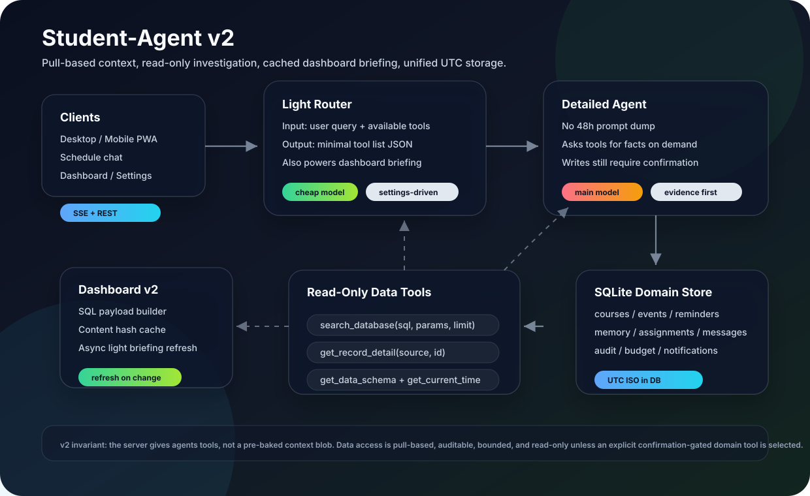

# Student-Agent v2

一个自托管的学生个人 AI 日程管家。它同步学习通、钉钉、本地日程和提醒，把高价值信息沉淀到统一数据库，并通过一个按需查询的 Schedule Agent 帮你调查、整理和执行任务。

v2 的核心变化：不再把 48 小时上下文硬塞进 prompt，也不再用硬编码 intent 决定工具。现在是 **light router 先选工具，主 agent 再按需只读查询数据库**；dashboard 也从独立 briefing 服务改成基于数据库 hash 的轻量刷新。



## 当前架构

前端是 React + Vite PWA，后端是 FastAPI + SQLite + APScheduler，部署层是 Docker Compose + Nginx。

Agent 链路分成两层：

- **Light Router / Briefing Agent**：便宜、快，只负责两件事：给当前 query 选择最小工具清单；在 dashboard 数据 hash 变化时生成最多 5 个行动项（todo）。首页不再渲染自然语言总结句，只保留「该先做这些」列表。
- **Detailed Schedule Agent**：负责真实回答和执行。它拿到 light router 给的工具清单后，通过工具主动拉取证据，不再依赖预注入的大块 context。

这里不是“两个数据库工具模式”。真正的工具面是：

- `get_current_time`：返回 Asia/Shanghai 与 UTC 的当前时间、今天、本周窗口。
- `get_data_schema`：告诉 agent 哪些表能查、时间字段怎么用、importance/tier 怎么理解。
- `search_database`：只读 SQL 查询。只允许 `SELECT` 和 `PRAGMA table_info`，只允许业务白名单表，屏蔽 token/cookie/key 等敏感字段。
- `get_record_detail`：对某条白名单记录拉更完整字段。
- 领域工具：课程、提醒、日历、学习通、消息、知识库、推送等。写操作仍走确认门，不会让 agent 自由写 SQL。

`search_database` 自带 `detail_level=brief|detailed`，它只控制返回字段截断长度；不是另一个 agent 模式。常规回答用 `brief`，需要核对原文或追问细节时再拉 `detailed`。

## 数据获取策略

旧版：

```text
server 预查 48h 数据 -> 拼进 build_turn_context() -> agent 被动读取
硬编码关键词 intent -> 固定工具清单
dashboard_briefing 服务 -> 独立生成首页文案
```

v2：

```text
用户 query -> light router 选工具 -> detailed agent 按需调用只读查询工具
dashboard /today -> SQL payload builder -> hash 变化才触发 light briefing
时间输入 -> Asia/Shanghai 解析 -> UTC ISO 存储和比较
```

这个改法保留现有数据库结构、importance、hierarchy_tier 和业务工具，只改变数据进入 agent 的方式：从“推”变成“拉”。

## Token 策略

v2 的省 token 点：

- 去掉每轮 `build_turn_context()` 的 48h 全量注入。
- 聊天历史窗口从 40 条缩到 12 条，长期事实必须由数据库工具拉取。
- light router 只输出 JSON 工具名，模型可在 Settings 单独选更便宜的。
- dashboard briefing 只在内容 hash 变化时刷新，普通打开首页不跑 LLM。
- tool result 默认 brief 截断，细节只在必要时二次查询。
- router、dashboard briefing、agent loop 都写入 token 预算表，账不会漏。

可重复跑 token 对比：

```bash
cd server-src
ACCESS_TOKEN=xxx BASE_URL=https://your-domain \
  python3 scripts/token_compare.py --label v2 --out /tmp/v2-tokens.json
```

如果有旧版结果：

```bash
python3 scripts/token_compare.py \
  --base-url https://your-domain \
  --token xxx \
  --baseline-json /tmp/baseline-tokens.json \
  --label v2
```

## 时间口径

统一规则：

- 用户无时区输入按 `Asia/Shanghai` 解释。
- 数据库存储和 SQL 比较统一用 UTC ISO，例如 `2026-06-12T10:30:00+00:00`。
- dashboard、agent schema、查询工具都暴露本地日/周窗口对应的 UTC 边界。
- 钉钉毫秒 epoch 会在查询说明中标注，避免和 ISO 字符串混用。

核心实现位于 `server-src/backend/app/services/time_utils.py`。

## Prompt 清单

当前需要维护的 prompt 有四类：

- `schedule_agent.STATIC_SYSTEM_PROMPT`：主 agent 行为约束。现在保持短 prompt，要求事实来自工具结果，不再塞业务上下文。
- `tool_router.select_tools_for_query()`：light router，只输出工具名 JSON。这里要避免写“回答用户”类指令。
- `dashboard_v2._briefing_system_prompt()`：首页轻 briefing，只基于输入 JSON 输出结构化 todo 列表（不再输出自然语言总结句）。
- 同步/过滤类 prompt：学习通 memory 提炼、钉钉过滤、standby push 决策。它们仍是各自模块的局部 prompt，不参与 schedule chat 的 context 注入。

Prompt 维护原则：主 agent 要少背规则，多看证据；router 要少选工具；dashboard briefing 要短、可缓存、可失败回退。

## 快速部署

服务器要求：

- Linux，推荐 Ubuntu 22.04+ 或 Debian 12+
- Docker + Docker Compose v2
- 一个 OpenAI 兼容或内置支持的 LLM Provider

安装：

```bash
git clone https://github.com/alanmacX/Student-Agent.git /opt/chatbot
cd /opt/chatbot/server-src
bash install.sh
```

`install.sh` 会交互生成 `.env`，**自动生成 `ACCESS_TOKEN`**（默认开启鉴权），
并在结尾打印出来——首次打开网页时输入一次即可。**公网访问请自行在前面加一层
HTTPS 反代/隧道**（见下「安全」），裸 HTTP 会泄露令牌和数据。

升级 / 部署（唯一推荐路径）：

```bash
cd /opt/chatbot
bash server-src/upgrade.sh
```

部署模型是**源码进镜像**：所有改动先提交进 git，`upgrade.sh` 走
`git pull --ff-only → docker compose build → docker compose up -d → 健康检查`。
不要再用 `docker cp` 往运行中的容器塞代码——那是已废弃的旧流程，`compose up` 会冲掉它。
改 `.env` 后同样必须 `compose up`：`docker restart` **不会**重新加载 `env_file`
（环境变量在创建容器时注入）。三端（本地 / GitHub / 服务器）应始终停在同一个 commit：
服务器是一个干净的 git 检出，本地改 → push → 服务器 `upgrade.sh`。

`upgrade.sh` 默认从当前源码构建 backend/frontend，启动容器，并检查
`GET /health` 与 `GET /api/dashboard/today`。常用参数：

- `--skip-pull`：不拉 git。
- `--skip-build`：不重建镜像，只重启。
- `--pull-images`：优先拉 ghcr 预构建镜像。
- `--no-healthcheck`：跳过部署后健康检查。

## 安全 / 访问控制

- **访问令牌**：所有 `/api/*` 由 `.env` 的 `ACCESS_TOKEN` 保护（中间件见
  `backend/app/main.py`）。**留空 = 完全不鉴权，禁止用于公网。** 用
  `openssl rand -hex 24` 生成；网页首次访问输入一次存浏览器，Siri 快捷指令用
  `?token=<值>`。少数公开端点（VAPID 公钥、推送回执）在 `PUBLIC_API_PATHS` 白名单内。
- **HTTPS 在源站强制**：`nginx.conf` 用 `X-Forwarded-Proto` 判断并 308 跳转，再发
  `Strict-Transport-Security`（HSTS）等安全头。与 CDN 厂商无关——换任何会转发该头的
  CDN/反代都生效；可信代理会覆盖该头，客户端无法伪造。前提铁律：**源站不暴露公网，
  只接受来自隧道 / 可信 CDN 回源的连接**，否则该头可被绕过伪造。
- **生产关闭调试**：`DEBUG=false`，`/api/debug/*` 不挂载。
- **密钥只进 `.env`**：`.env` 已被 `.gitignore` 排除，不进 git，仓库内只有
  `.env.example` 模板。LLM key、`DINGTALK_AES_KEY`、`VAPID_PRIVATE_KEY`、`ZJUT_KEY`
  都从环境读取，源码中无硬编码密钥。

## 公网 HTTPS（复制即用）

`install.sh` 装出来是 `http://IP:80`。公网使用**必须**在前面加一层 HTTPS。任选其一，
都让源站只听本地 80、不直接暴露公网：

**方案 A — Cloudflare Tunnel**（源站零暴露，无需开放入站端口、无需自己管证书）：

```bash
# 在服务器上
curl -L https://github.com/cloudflare/cloudflared/releases/latest/download/cloudflared-linux-amd64 -o /usr/local/bin/cloudflared
chmod +x /usr/local/bin/cloudflared
cloudflared tunnel login                      # 浏览器授权你的域名
cloudflared tunnel create student-agent
# /etc/cloudflared/config.yml:
#   tunnel: <上一步的 tunnel id>
#   credentials-file: /root/.cloudflared/<id>.json
#   ingress:
#     - hostname: your.domain.com
#       service: http://localhost:80
#     - service: http_status:404
cloudflared tunnel route dns student-agent your.domain.com
cloudflared service install && systemctl restart cloudflared
```

Cloudflare 边缘自动签发/续期证书，并发 `X-Forwarded-Proto` —— 源站的 `nginx.conf`
会据此强制 HTTPS。**别把域名 DNS 直接 A 记录指向服务器 IP**，只用隧道的 CNAME。

**方案 B — Caddy 自动 HTTPS**（自己的机器直连公网、80/443 可入站时）：

```caddyfile
# /etc/caddy/Caddyfile
your.domain.com {
    reverse_proxy localhost:80      # 转发到本项目的 nginx
}
```

```bash
# 把 docker-compose 的 nginx 端口从 80:80 改成 127.0.0.1:80:80（只听本地），
# 让 Caddy 独占公网 80/443，然后：
systemctl reload caddy
```

Caddy 自动申请并续期 Let's Encrypt 证书，并默认转发 `X-Forwarded-Proto`。

## 迁移到新服务器（无痛）

数据全在一个 SQLite 库里，迁移 = 导出 db + `.env` → 新机导入。`.env` 一并带走，
**访问令牌和推送密钥不变**，旧网页 / 手机 / Siri 快捷指令无需重新登录。

```bash
# ① 旧服务器：一键导出（db + .env 打成一个包）
cd /opt/chatbot && bash server-src/scripts/backup.sh
#   → student-agent-backup-<时间>.tgz

# ② 传到新服务器
scp student-agent-backup-*.tgz newserver:/tmp/

# ③ 新服务器：照常安装，再导入
git clone https://github.com/alanmacX/Student-Agent.git /opt/chatbot
cd /opt/chatbot/server-src && bash install.sh
bash server-src/scripts/restore.sh /tmp/student-agent-backup-*.tgz
```

`restore.sh` 会停 backend、把旧库写进数据卷、用旧 `.env` 覆盖（新装生成的 `.env`
留作 `.env.fresh.*`），再 `--force-recreate` 重启让令牌生效。钉钉登录是设备态、不随
库迁移，新机在 Settings → 钉钉 重新扫码即可；学习通同理。

## 设置

所有 provider 平等支持（任何 OpenAI 兼容接口）。**推荐 DeepSeek**——代码里有
DeepSeek 专属优化（思考模式、缓存计费、自动重试），性价比好；但**不强制**，用你手上
有 key 的任意 provider 都行。DeepSeek 已作为内置 provider 预置，填 key 即用。

进入 Settings 后至少确认：

- **Schedule Agent Provider**：主 agent 模型，负责复杂推理和工具调用。
- **Light Router / Briefing Agent**：工具路由和 dashboard briefing 模型，建议选便宜快速模型。
- **Filter Provider**：消息过滤/提炼使用的模型。
- **Token Budget**：每日预算；analytics 会汇总 chat、schedule、standby、router、dashboard briefing。

## 本地验证

```bash
# 后端语法检查
python3 -m compileall server-src/backend/app

# 前端构建
cd server-src/frontend && npm run build

# token 采样
cd ../
BASE_URL=http://localhost ACCESS_TOKEN=xxx python3 scripts/token_compare.py
```

## 目录

```text
.
├── docs/
│   └── architecture-v2.svg
├── server-src/
│   ├── backend/
│   │   └── app/
│   │       ├── routers/
│   │       ├── services/
│   │       ├── memory/
│   │       └── tasks/
│   ├── frontend/
│   ├── scripts/
│   │   └── token_compare.py
│   ├── docker-compose.yml
│   ├── install.sh
│   └── upgrade.sh
└── README.md
```

## 运维排查

```bash
cd /opt/chatbot/server-src
docker compose ps
docker compose logs --tail=160 backend
curl -fsS http://localhost/health
curl -fsS -H "Authorization: Bearer $ACCESS_TOKEN" http://localhost/api/dashboard/today
```

如果 agent 回答短视，优先检查该轮 SSE 里是否出现了 `search_database` / `get_data_schema` 工具调用；如果没有，先看 light router 输出和 fallback 工具清单。
